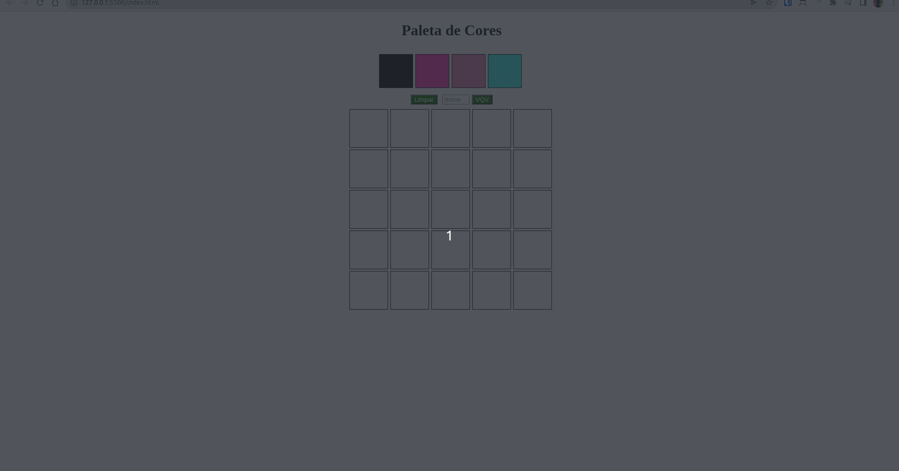

## O que é o projeto Trybe Pixel Art:

Neste projeto, tive a oportunidade de aprender a manipular o DOM utilizando javascript, criando uma página em que são exibidos píxels, e o usuário ṕode clicar em uma das cores geradas aleatoriamente, e então pintar cada pixel conforme desejar.
Também é possível alterar o tamanho do quadro, para mostar um quadro do ta manho 50x50 pixéls na tela. 

Para isto, utilizei HTML, CSS e Javascript. 

## Exemplo da aplicação:

